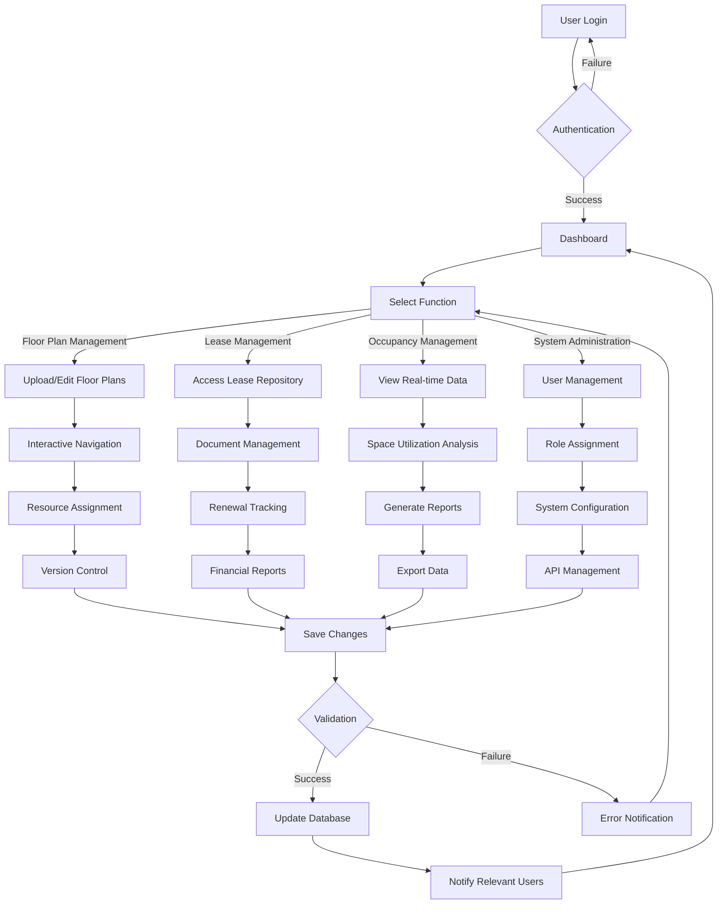
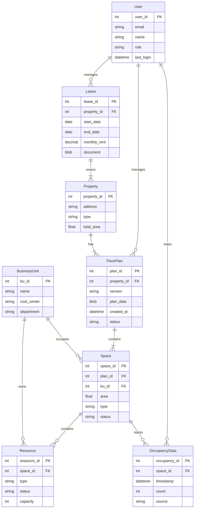
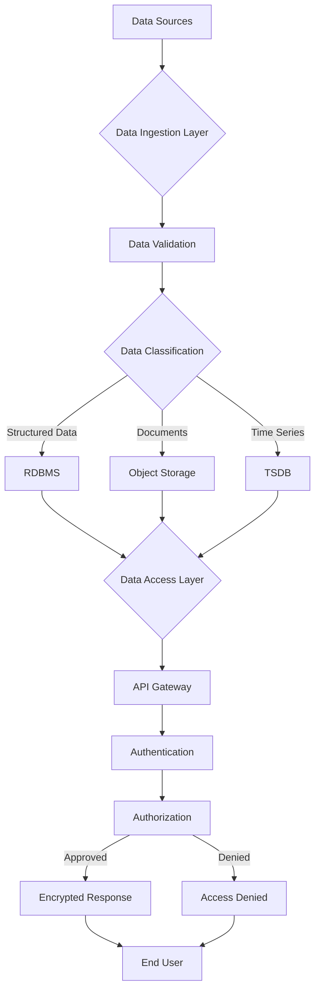
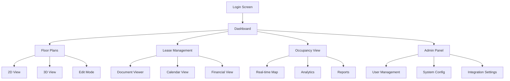
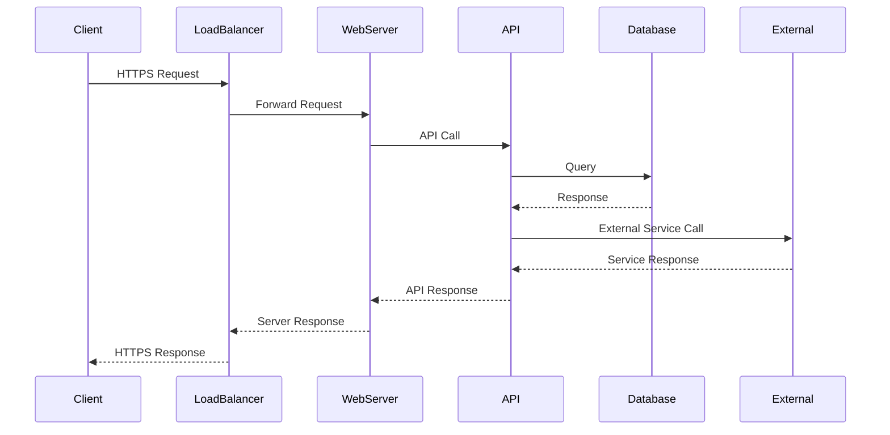

# Product Requirements Document (PRD)

## 1. INTRODUCTION

### 1.1 Purpose

This Software Requirements Specification (SRS) document provides a comprehensive description of the lightweight Integrated Workplace Management System (IWMS). It details the functional and non-functional requirements for developers, project managers, QA teams, and stakeholders involved in the development and implementation of the system.

### 1.2 Scope

The lightweight IWMS is a web-based platform designed to streamline workplace and facility management operations without the complexity of traditional enterprise IWMS solutions. The system encompasses:

- Interactive floor plan management with 2D/3D visualization capabilities
- Lease document management and tracking system
- Real-time occupancy monitoring and analytics
- Role-based access control
- Reporting and analytics dashboards
- Mobile accessibility
- Integration capabilities with external systems

Key benefits include:

- Simplified space allocation and resource management
- Improved lease compliance and renewal tracking
- Data-driven decision making for space utilization
- Reduced operational costs through efficient space management
- Quick deployment and minimal training requirements

Out of scope:
- Advanced facility maintenance workflows
- Complex asset lifecycle management
- Energy management systems
- Project management tools
- Detailed capital planning features

The system will support multiple user roles including Corporate Real Estate Teams, Facility Managers, Space Planners, and Business Unit Administrators, providing them with tailored access to manage their respective areas of responsibility.

## 2. PRODUCT DESCRIPTION

### 2.1 Product Perspective

The lightweight IWMS operates as a standalone web-based application that integrates with existing enterprise systems. It serves as a centralized platform for workplace management while maintaining the following system interfaces:

- Building Management Systems (BMS) for occupancy sensor data
- HR systems for employee data synchronization
- Financial systems for cost allocation and lease payment tracking
- Authentication systems for Single Sign-On (SSO) capabilities
- Mobile devices through responsive web interface

### 2.2 Product Functions

The system provides the following core functions:

1. Floor Plan Management
   - Upload and maintain 2D/3D floor plans
   - Interactive navigation and visualization
   - Resource and business unit assignment
   - Version control and change history tracking

2. Lease Administration
   - Digital lease document repository
   - Automated renewal notifications
   - Financial tracking and reporting
   - Multi-location lease management

3. Occupancy Management
   - Real-time occupancy data integration
   - Space utilization analytics
   - Visual occupancy mapping
   - Trend analysis and reporting

4. System Administration
   - Role-based access control
   - User management
   - System configuration
   - Data export and API access

### 2.3 User Characteristics

1. Corporate Real Estate Teams
   - Advanced users with extensive knowledge of property management
   - Require access to all system functions
   - Focus on strategic planning and cost management

2. Facility Managers
   - Intermediate to advanced users
   - Primary focus on space allocation and resource management
   - Regular system interaction for daily operations

3. Space Planners
   - Technical users with CAD/space planning expertise
   - Heavy usage of floor plan management features
   - Need detailed visualization and editing capabilities

4. Business Unit Administrators
   - Basic to intermediate users
   - Limited access to specific areas and reports
   - Occasional system usage for space management

### 2.4 Constraints

1. Technical Constraints
   - Must operate within standard web browsers
   - Maximum file size of 100MB for floor plan uploads
   - Support for latest two versions of major browsers
   - Maximum response time of 3 seconds for standard operations

2. Regulatory Constraints
   - Compliance with data privacy regulations (GDPR, CCPA)
   - Adherence to accessibility standards (WCAG 2.1)
   - Secure storage of lease documents

3. Business Constraints
   - Implementation timeline of 6 months
   - Limited training period of 2 weeks per user group
   - Budget constraints requiring cloud-based deployment

### 2.5 Assumptions and Dependencies

Assumptions:
- Users have basic computer literacy
- Stable internet connectivity at all locations
- Access to modern web browsers
- Availability of accurate floor plan documentation
- Consistent data formats from integrated systems

Dependencies:
- Integration APIs from external systems
- Occupancy sensor infrastructure
- Network capacity for real-time data transmission
- Available technical support for implementation
- Vendor support for third-party components

## 3. PROCESS FLOWCHART

## 4. FUNCTIONAL REQUIREMENTS

### 4.1 Floor Plan Management

#### ID: FPM
#### Description
Interactive visualization and management of building floor plans with resource allocation capabilities.
#### Priority: High

| ID | Requirement | Description | Priority |
|---|-------------|-------------|-----------|
| FPM-1 | Floor Plan Upload | Support upload of 2D/3D floor plans in CAD, PDF, and common image formats (PNG, JPEG) | High |
| FPM-2 | Interactive Navigation | Provide zoom, pan, and rotation controls for floor plan viewing | High |
| FPM-3 | Resource Assignment | Enable drag-and-drop assignment of resources to specific areas | High |
| FPM-4 | Version Control | Maintain version history of floor plan changes with timestamps and user information | Medium |
| FPM-5 | Space Editing | Tools for modifying space assignments and resource labels | High |
| FPM-6 | Multi-floor Navigation | Quick switching between different floors and buildings | Medium |
| FPM-7 | Export Capabilities | Export floor plans with current assignments in PDF and image formats | Low |

### 4.2 Lease Management

#### ID: LMS
#### Description
Digital management of lease documents, renewals, and financial tracking.
#### Priority: High

| ID | Requirement | Description | Priority |
|---|-------------|-------------|-----------|
| LMS-1 | Document Repository | Secure storage and retrieval of lease documents with search functionality | High |
| LMS-2 | Renewal Tracking | Automated notifications for lease expiration and renewal deadlines | High |
| LMS-3 | Financial Management | Track rent payments, CAM charges, and cost allocations | High |
| LMS-4 | Multi-location Support | Management of leases across multiple properties and regions | Medium |
| LMS-5 | Document Version Control | Track changes and maintain versions of lease documents | Medium |
| LMS-6 | Cost Reporting | Generate financial reports for lease costs and allocations | Medium |
| LMS-7 | Document Templates | Standardized templates for common lease documents | Low |

### 4.3 Occupancy Management

#### ID: OCM
#### Description
Real-time occupancy monitoring and analytics system.
#### Priority: Medium

| ID | Requirement | Description | Priority |
|---|-------------|-------------|-----------|
| OCM-1 | Sensor Integration | API integration with occupancy sensors and BMS | High |
| OCM-2 | Real-time Display | Live visualization of occupancy data on floor plans | High |
| OCM-3 | Historical Analysis | Track and analyze occupancy patterns over time | Medium |
| OCM-4 | Utilization Reports | Generate reports on space utilization and efficiency | Medium |
| OCM-5 | Threshold Alerts | Notifications for occupancy thresholds and anomalies | Medium |
| OCM-6 | Data Export | Export occupancy data in standard formats (CSV, Excel) | Low |
| OCM-7 | Custom Analytics | User-defined metrics and analysis parameters | Low |

### 4.4 System Administration

#### ID: ADM
#### Description
System configuration and user management capabilities.
#### Priority: High

| ID | Requirement | Description | Priority |
|---|-------------|-------------|-----------|
| ADM-1 | User Management | Create, modify, and deactivate user accounts | High |
| ADM-2 | Role Management | Define and assign user roles with specific permissions | High |
| ADM-3 | System Configuration | Configure system parameters and integration settings | High |
| ADM-4 | API Management | Manage API keys and access controls | Medium |
| ADM-5 | Audit Logging | Track system activities and user actions | Medium |
| ADM-6 | Backup/Restore | Automated backup and restore capabilities | Medium |
| ADM-7 | System Monitoring | Monitor system performance and usage metrics | Low |

## 5. NON-FUNCTIONAL REQUIREMENTS

### 5.1 Performance Requirements

| ID | Requirement | Description | Target Metric |
|---|-------------|-------------|---------------|
| PRF-1 | Page Load Time | Initial page load time for dashboard and main interfaces | < 3 seconds |
| PRF-2 | Floor Plan Rendering | Time to load and render interactive floor plans | < 5 seconds for standard plans |
| PRF-3 | Concurrent Users | System should handle multiple simultaneous users | 500 concurrent users |
| PRF-4 | API Response Time | Maximum response time for API calls | < 1 second |
| PRF-5 | Report Generation | Time to generate standard reports | < 30 seconds |
| PRF-6 | Search Operations | Response time for search queries | < 2 seconds |
| PRF-7 | Database Transactions | Transaction processing time | < 500ms |

### 5.2 Safety Requirements

| ID | Requirement | Description |
|---|-------------|-------------|
| SFT-1 | Data Backup | Automated daily backups with 30-day retention |
| SFT-2 | Disaster Recovery | Recovery Point Objective (RPO) of 24 hours |
| SFT-3 | System Redundancy | Redundant system components to prevent single points of failure |
| SFT-4 | Data Validation | Input validation to prevent data corruption |
| SFT-5 | Error Handling | Graceful error handling with user-friendly messages |
| SFT-6 | Session Management | Automatic session timeout after 30 minutes of inactivity |

### 5.3 Security Requirements

| ID | Requirement | Description |
|---|-------------|-------------|
| SEC-1 | Authentication | SSO integration with support for MFA |
| SEC-2 | Authorization | Role-based access control with granular permissions |
| SEC-3 | Data Encryption | AES-256 encryption for data at rest |
| SEC-4 | Transport Security | TLS 1.3 for all data in transit |
| SEC-5 | Audit Logging | Comprehensive logging of all security events |
| SEC-6 | Password Policy | Complex password requirements and regular rotation |
| SEC-7 | API Security | OAuth 2.0 implementation for API access |

### 5.4 Quality Requirements

| Category | ID | Requirement | Target Metric |
|----------|---|-------------|---------------|
| Availability | QUA-1 | System Uptime | 99.9% availability |
| Maintainability | QUA-2 | Update Window | Monthly maintenance window < 4 hours |
| Usability | QUA-3 | User Training | < 2 hours training for basic users |
| Scalability | QUA-4 | Horizontal Scaling | Support 25% annual user growth |
| Reliability | QUA-5 | Mean Time Between Failures | > 720 hours |
| Performance | QUA-6 | Browser Compatibility | Support latest 2 versions of major browsers |
| Accessibility | QUA-7 | WCAG Compliance | WCAG 2.1 Level AA compliance |

### 5.5 Compliance Requirements

| ID | Requirement | Description |
|---|-------------|-------------|
| CMP-1 | Data Privacy | GDPR and CCPA compliance for personal data handling |
| CMP-2 | Data Retention | Configurable data retention policies |
| CMP-3 | Accessibility | Section 508 compliance for federal accessibility standards |
| CMP-4 | Industry Standards | ISO 27001 compliance for information security |
| CMP-5 | Documentation | Maintenance of compliance documentation and audit trails |
| CMP-6 | Data Sovereignty | Regional data storage compliance |
| CMP-7 | Export Controls | Compliance with data export regulations |

## 6. DATA REQUIREMENTS

### 6.1 Data Models

### 6.2 Data Storage

| Category | Requirement | Description |
|----------|-------------|-------------|
| Primary Storage | Relational Database | PostgreSQL for structured data storage |
| Document Storage | Object Storage | S3-compatible storage for floor plans and lease documents |
| Time Series Data | Time Series DB | InfluxDB for occupancy sensor data |
| Cache Layer | In-Memory Cache | Redis for session management and API response caching |
| Data Retention | Tiered Storage | - Active data: 12 months in primary storage - Historical data: 5 years in cold storage - Lease documents: 10 years retention |
| Backup Strategy | Automated Backups | - Daily incremental backups - Weekly full backups - 30-day retention for daily backups - 12-month retention for weekly backups |
| Data Redundancy | Geographic Replication | - Primary and secondary region replication - 99.99% durability SLA - Cross-region backup storage |

### 6.3 Data Processing

| Security Layer | Implementation |
|----------------|----------------|
| Data at Rest | AES-256 encryption |
| Data in Transit | TLS 1.3 encryption |
| Access Control | Role-based access with row-level security |
| API Security | OAuth 2.0 with JWT tokens |
| Data Masking | PII and sensitive data masking |
| Audit Trail | Comprehensive logging of data access and modifications |

### 6.4 Data Integration

| System | Integration Type | Data Flow | Frequency |
|--------|-----------------|----------|------------|
| HR Systems | REST API | Employee data synchronization | Daily |
| BMS | Message Queue | Real-time occupancy sensor data | Real-time |
| Financial Systems | REST API | Cost allocation and lease payments | Daily |
| Authentication Provider | SAML/OAuth | User authentication and authorization | Real-time |
| Mobile Devices | REST API | Floor plan and occupancy data access | On-demand |

## 7. EXTERNAL INTERFACES

### 7.1 User Interfaces

| Interface Element | Description | Requirements |
|------------------|-------------|--------------|
| Dashboard | Main control center | - Responsive layout (1024px-4K) - Dark/light mode support - Customizable widgets - Quick access toolbar |
| Floor Plan Viewer | Interactive space visualization | - Multi-touch gesture support - Zoom controls (25%-400%) - Layer toggle controls - Mini-map navigation |
| Lease Manager | Document and payment tracking | - Split-pane document viewer - Calendar integration - Drag-drop file upload - Search/filter controls |
| Admin Console | System configuration interface | - Tree-view navigation - Batch operation support - Real-time validation - Status indicators |

### 7.2 Hardware Interfaces

| Component | Interface Type | Specifications |
|-----------|---------------|----------------|
| Occupancy Sensors | REST/MQTT | - Protocol: MQTT 3.1.1 - Data rate: 1 sample/minute - Payload size: <1KB - Error detection: CRC32 |
| Mobile Devices | Web Browser | - Minimum resolution: 360x640px - Touch input support - GPS capability for location services |
| Printers | IPP | - Protocol: IPP 2.0 - Format support: PDF/A, PNG - Resolution: ≥300dpi |
| Building Management Systems | API/SDK | - Protocol: REST/SOAP - Authentication: OAuth 2.0 - Response time: <500ms |

### 7.3 Software Interfaces

| System | Interface Type | Data Exchange | Authentication |
|--------|---------------|---------------|----------------|
| HR System | REST API | - Employee data - Department info - Cost centers | OAuth 2.0 |
| Financial System | REST API | - Lease payments - Cost allocations - Budgets | API Key + JWT |
| SSO Provider | SAML 2.0 | - User authentication - Role mapping - Session management | SAML Assertions |
| Document Management | S3 API | - Lease documents - Floor plans - Reports | IAM Roles |
| Analytics Platform | GraphQL | - Occupancy metrics - Usage patterns - Custom reports | API Key |

### 7.4 Communication Interfaces

| Protocol | Usage | Specifications |
|----------|-------|----------------|
| HTTPS | Web Traffic | - TLS 1.3 - Certificate: EV SSL - HSTS enabled |
| WebSocket | Real-time Updates | - WSS protocol - Heartbeat: 30s - Auto-reconnect |
| MQTT | Sensor Data | - QoS Level 1 - Retain flag enabled - Clean session |
| SMTP | Notifications | - TLS encryption - DKIM signing - SPF validation |
| LDAP | Directory Services | - LDAPS (636) - Connection pooling - Referral following |

## 8. APPENDICES

### 8.1 GLOSSARY

| Term | Definition |
|------|------------|
| Business Unit (BU) | An organizational division or department within a company that operates as a distinct entity |
| Common Area Maintenance (CAM) | Additional charges in a lease for maintaining shared spaces |
| Floor Plan | A scale diagram of the arrangement of rooms in one story of a building |
| Lease | A contract by which one party conveys property to another for a specified time |
| Resource | Any physical asset within a workspace (workstations, meeting rooms, equipment) |
| Space Utilization | The measurement of how physical space is being used compared to its total capacity |
| Workspace | A physical location where work is performed |

### 8.2 ACRONYMS

| Acronym | Definition |
|---------|------------|
| API | Application Programming Interface |
| BMS | Building Management System |
| CCPA | California Consumer Privacy Act |
| GDPR | General Data Protection Regulation |
| HSTS | HTTP Strict Transport Security |
| IAM | Identity and Access Management |
| IPP | Internet Printing Protocol |
| IWMS | Integrated Workplace Management System |
| JWT | JSON Web Token |
| MFA | Multi-Factor Authentication |
| MQTT | Message Queuing Telemetry Transport |
| PII | Personally Identifiable Information |
| REST | Representational State Transfer |
| SAML | Security Assertion Markup Language |
| SLA | Service Level Agreement |
| SSO | Single Sign-On |
| TSDB | Time Series Database |
| WCAG | Web Content Accessibility Guidelines |
| WSS | WebSocket Secure |

### 8.3 ADDITIONAL REFERENCES

| Category | Reference | Description |
|----------|-----------|-------------|
| Standards | ISO/IEC 27001:2013 | Information security management systems requirements |
| Standards | WCAG 2.1 | Web accessibility guidelines |
| Technical | PostgreSQL Documentation | Database implementation reference |
| Technical | Redis Documentation | Caching layer implementation guide |
| Technical | OAuth 2.0 Specification | Authentication protocol implementation |
| Industry | BOMA Standards | Building measurement and space classification standards |
| Industry | IFMA Space Measurement | Facility space measurement standards |
| Legal | GDPR Documentation | Data protection compliance guidelines |
| Legal | CCPA Documentation | California privacy law compliance guidelines |