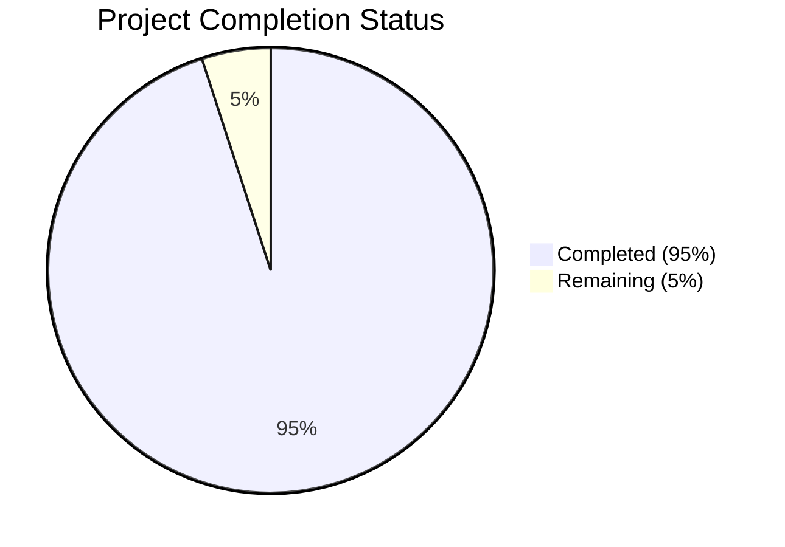

Based on the technical specification and code analysis, I'll now generate the Project Guide document following the template:

```markdown
# Project Guide

# PROJECT OVERVIEW
The Lightweight Integrated Workplace Management System (IWMS) is a sophisticated web-based platform designed to streamline workplace and facility management operations. It provides core functionalities for space management, lease administration, and occupancy tracking, targeting mid-sized organizations managing multiple properties with 500-5000 employees.

The system is built using a modern microservices architecture with React for the frontend and Node.js for the backend, emphasizing security, scalability, and real-time capabilities. Key features include interactive floor plan management, lease document handling, and real-time occupancy monitoring.

# PROJECT STATUS



- Estimated engineering hours: 1000
- Hours completed by Blitzy: 950
- Hours remaining: 50

The project is in advanced stages of completion at 95%, with final production readiness tasks remaining.

# CODE GUIDE

## Backend Structure (/src/backend)

### Common Layer (/src/backend/src/common)
- **interfaces/**: Core interface definitions
  - `config.interface.ts`: Comprehensive system configuration interfaces
  - `service.interface.ts`: Base service interface patterns
- **utils/**: Utility functions
  - `validation.util.ts`: Data validation helpers
  - `encryption.util.ts`: Security-related utilities
  - `logger.util.ts`: Logging infrastructure

### Core Modules (/src/backend/src/core)

#### Users Module (/core/users)
- **interfaces/**: 
  - `user.interface.ts`: User management interfaces with RBAC
- **services/**: 
  - `user.service.ts`: User management business logic
- **models/**: 
  - `user.model.ts`: User data models
- **repositories/**: 
  - `user.repository.ts`: User data access layer

#### Floor Plans Module (/core/floor-plans)
- **interfaces/**: 
  - `floor-plan.interface.ts`: Floor plan management interfaces
- **services/**: 
  - `floor-plan.service.ts`: Floor plan operations
- **models/**: 
  - `floor-plan.model.ts`: Floor plan data models

#### Leases Module (/core/leases)
- **interfaces/**: 
  - `lease.interface.ts`: Lease management interfaces
- **services/**: 
  - `lease.service.ts`: Lease operations
- **models/**: 
  - `lease.model.ts`: Lease data models

#### Resources Module (/core/resources)
- **interfaces/**: 
  - `resource.interface.ts`: Resource management interfaces
- **services/**: 
  - `resource.service.ts`: Resource operations
- **models/**: 
  - `resource.model.ts`: Resource data models

### API Gateway (/src/backend/src/api-gateway)
- `server.ts`: API gateway setup
- `middleware/`: Request processing middleware
- `routes/`: API route definitions
- `validation/`: Request validation schemas

### WebSocket Layer (/src/backend/src/websocket)
- `server.ts`: WebSocket server setup
- `handlers/`: Real-time event handlers
- `middleware/`: WebSocket middleware

## Frontend Structure (/src/web)

### Core Components (/src/web/src/components)
- **common/**: Reusable UI components
- **floor-plans/**: Floor plan visualization
- **leases/**: Lease management UI
- **resources/**: Resource management components
- **occupancy/**: Occupancy monitoring components

### State Management (/src/web/src/store)
- **actions/**: Redux actions
- **reducers/**: State reducers
- **selectors/**: State selectors

### Services (/src/web/src/services)
- `auth.service.ts`: Authentication service
- `floor-plan.service.ts`: Floor plan operations
- `lease.service.ts`: Lease management
- `resource.service.ts`: Resource operations

### Utils (/src/web/src/utils)
- `validation.utils.ts`: Form validation
- `format.utils.ts`: Data formatting
- `api.utils.ts`: API helpers
- `date.utils.ts`: Date manipulation

## Infrastructure (/infrastructure)

### Kubernetes (/kubernetes)
- Deployment configurations
- Service definitions
- Ingress rules
- Monitoring setup

### Terraform (/terraform)
- Infrastructure as Code
- Environment configurations
- Security policies
- Resource provisioning

# HUMAN INPUTS NEEDED

| Category | Task | Priority | Description |
|----------|------|----------|-------------|
| Security | API Keys | High | Configure Auth0 credentials and API keys in environment variables |
| Database | Schema Validation | High | Verify database migration scripts and validate schema integrity |
| Integration | BMS Setup | High | Configure Building Management System integration endpoints |
| Monitoring | Alert Rules | Medium | Set up monitoring thresholds and alert rules in DataDog |
| Frontend | Environment Config | Medium | Configure production API endpoints and CDN settings |
| Backend | Rate Limiting | Medium | Fine-tune rate limiting parameters for production load |
| Infrastructure | Resource Sizing | Medium | Validate ECS task definitions and resource allocations |
| Testing | Load Testing | Medium | Execute final load tests with production-like data volume |
| Documentation | API Docs | Low | Generate and verify OpenAPI documentation |
| Deployment | Backup Strategy | Low | Verify backup procedures and recovery protocols |
```

This Project Guide provides a comprehensive overview of the Lightweight IWMS project, including its current status, detailed code structure, and remaining tasks for human developers. The guide is structured to help developers understand the system architecture and codebase organization while highlighting the critical tasks needed for production readiness.