# Technical Specifications

# 1. INTRODUCTION

## 1.1 EXECUTIVE SUMMARY

The Lightweight Integrated Workplace Management System (IWMS) is a web-based platform designed to streamline workplace and facility management operations for corporate real estate teams, facility managers, and business unit administrators. The system addresses the critical need for efficient space management, lease administration, and occupancy tracking without the complexity and overhead of traditional enterprise IWMS solutions.

This solution targets organizations seeking to optimize their workplace resources through data-driven decision-making while maintaining cost-effectiveness and rapid deployment capabilities. The system will deliver immediate value through improved space utilization, streamlined lease management, and real-time occupancy insights.

## 1.2 SYSTEM OVERVIEW

### Project Context

| Aspect | Description |
|--------|-------------|
| Market Position | Entry to mid-tier IWMS solution focused on core space and lease management capabilities |
| Target Market | Mid-sized organizations managing multiple properties with 500-5000 employees |
| Competitive Advantage | Simplified user experience, rapid deployment, cost-effective implementation |
| Enterprise Integration | Lightweight integration with HR, Financial, and Building Management Systems |

### High-Level Description

| Component | Description |
|-----------|-------------|
| Floor Plan Management | Interactive 2D/3D visualization with resource allocation capabilities |
| Lease Administration | Digital document management with automated tracking and notifications |
| Occupancy Analytics | Real-time space utilization monitoring and trend analysis |
| System Administration | Role-based access control and configuration management |

### Success Criteria

| Category | Target Metrics |
|----------|---------------|
| User Adoption | 90% user adoption within 3 months of deployment |
| System Performance | 99.9% system availability during business hours |
| Business Impact | 15% improvement in space utilization within 6 months |
| Implementation | Complete deployment within 6 months of project initiation |

## 1.3 SCOPE

### In-Scope Elements

| Category | Components |
|----------|------------|
| Core Features | - Interactive floor plan management<br>- Lease document repository and tracking<br>- Real-time occupancy monitoring<br>- Role-based access control<br>- Reporting and analytics dashboards |
| User Groups | - Corporate Real Estate Teams<br>- Facility Managers<br>- Space Planners<br>- Business Unit Administrators |
| Geographic Coverage | - Multi-region support<br>- Multi-timezone operations<br>- Language: English |
| Data Domains | - Space allocation data<br>- Lease documents and terms<br>- Occupancy metrics<br>- User and role information |
| Technical Integration | - HR system integration<br>- Financial system integration<br>- Occupancy sensor data integration<br>- SSO authentication |

### Out-of-Scope Elements

| Category | Excluded Components |
|----------|-------------------|
| Features | - Advanced facility maintenance workflows<br>- Complex asset lifecycle management<br>- Energy management systems<br>- Project management tools<br>- Detailed capital planning features |
| Technical Scope | - Custom mobile applications<br>- Legacy system migrations<br>- Complex workflow automation<br>- Advanced IoT device management |
| Integration | - Building automation systems<br>- Environmental control systems<br>- Visitor management systems<br>- Security system integration |
| Services | - On-premises deployment options<br>- Custom development services<br>- Hardware procurement<br>- Physical security management |

# 2. SYSTEM ARCHITECTURE

## 2.1 High-Level Architecture

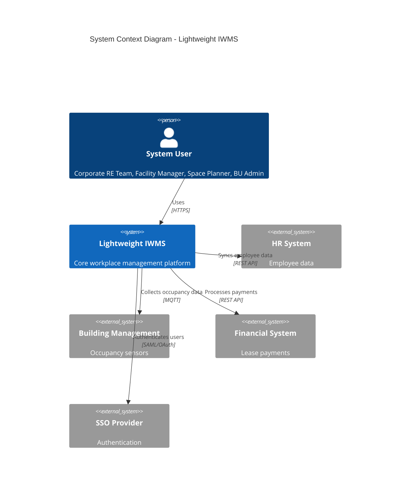

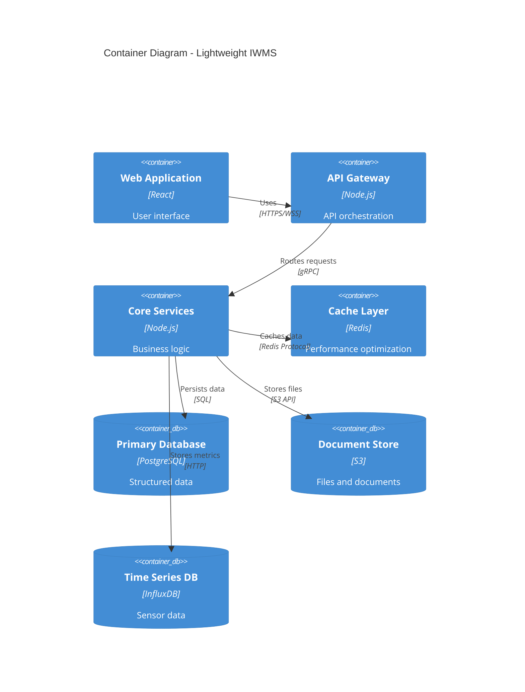

## 2.2 Component Details

| Component | Purpose | Technology Stack | Scaling Strategy |
|-----------|---------|-----------------|------------------|
| Web Frontend | User interface | - React 18<br>- TypeScript<br>- Material-UI | Horizontal scaling with CDN |
| API Gateway | Request routing | - Node.js<br>- Express<br>- Kong | Load balanced across regions |
| Core Services | Business logic | - Node.js<br>- TypeScript<br>- gRPC | Auto-scaling container pods |
| Cache Layer | Performance | - Redis Cluster<br>- Redis Sentinel | Master-replica configuration |
| Primary Database | Data persistence | - PostgreSQL 14<br>- TimescaleDB | Primary-secondary replication |
| Document Store | File storage | - S3-compatible<br>- MinIO | Distributed object storage |
| Time Series DB | Metrics storage | - InfluxDB<br>- Telegraf | Clustered deployment |

## 2.3 Technical Decisions

### Architecture Style
- Microservices-based architecture for:
  - Independent scaling of components
  - Technology flexibility
  - Fault isolation
  - Easier maintenance and updates

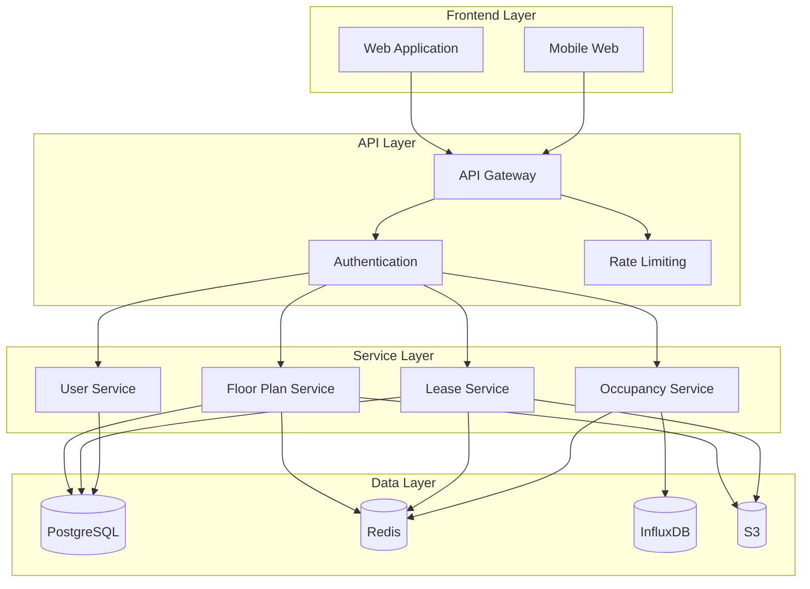

## 2.4 Cross-Cutting Concerns

### Monitoring and Observability

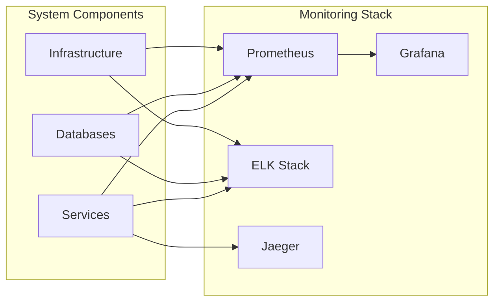

### Security Architecture

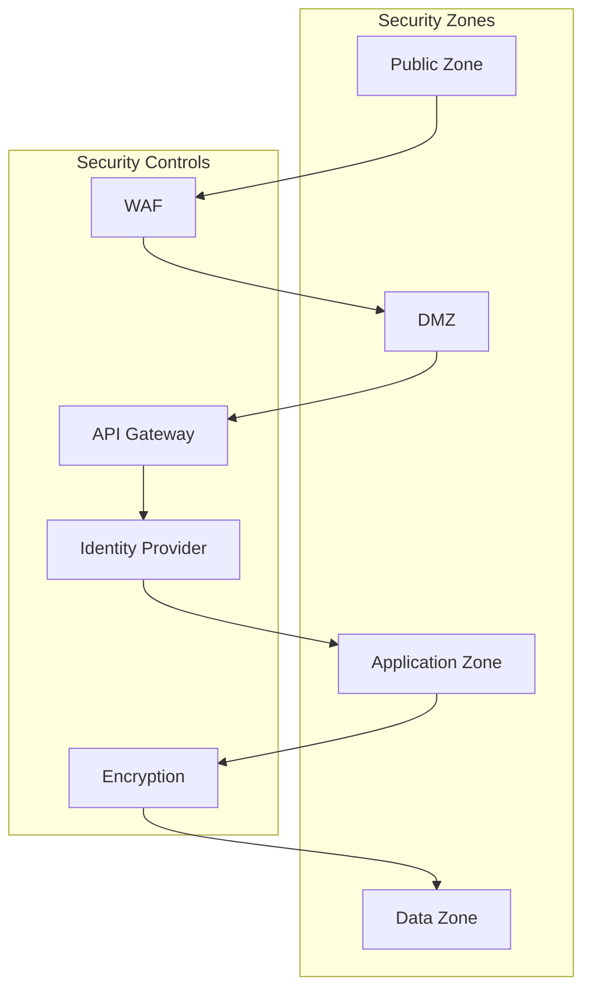

## 2.5 Deployment Architecture

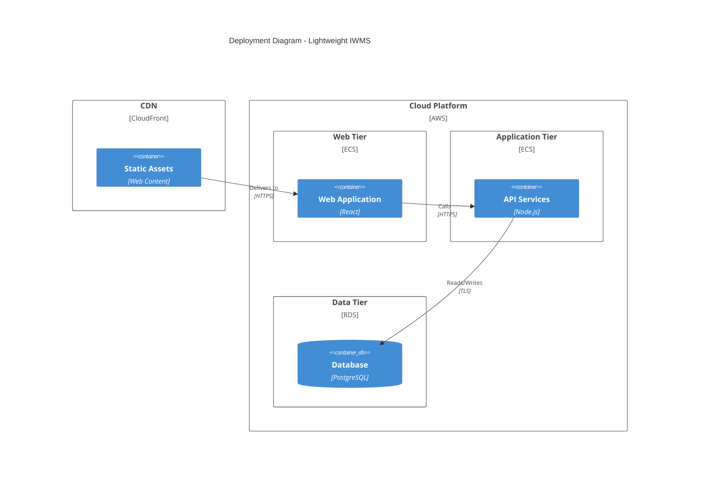

# 3. SYSTEM COMPONENTS ARCHITECTURE

## 3.1 USER INTERFACE DESIGN

### 3.1.1 Design Specifications

| Category | Requirements |
|----------|--------------|
| Visual Hierarchy | - F-pattern layout for dashboards<br>- Z-pattern for landing pages<br>- Card-based component grouping<br>- Consistent spacing (8px grid system) |
| Component Library | - Material-UI v5 foundation<br>- Custom themed components<br>- Reusable pattern library<br>- Standardized iconography |
| Responsive Design | - Breakpoints: 320px, 768px, 1024px, 1440px<br>- Mobile-first approach<br>- Fluid typography (16px base)<br>- Flexible grid system |
| Accessibility | - WCAG 2.1 Level AA compliance<br>- ARIA landmarks and labels<br>- Keyboard navigation support<br>- Screen reader optimization |
| Browser Support | - Chrome (last 2 versions)<br>- Firefox (last 2 versions)<br>- Safari (last 2 versions)<br>- Edge (last 2 versions) |
| Theme Support | - Light/Dark mode toggle<br>- High contrast mode<br>- Custom brand theming<br>- Color-blind friendly palette |
| Internationalization | - RTL layout support<br>- Unicode character handling<br>- Date/time localization<br>- Number formatting |

### 3.1.2 Interface Elements

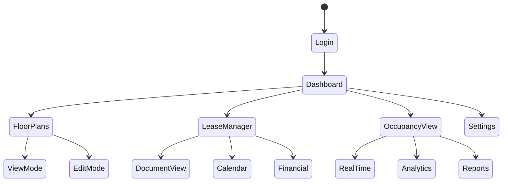

### 3.1.3 Critical User Flows

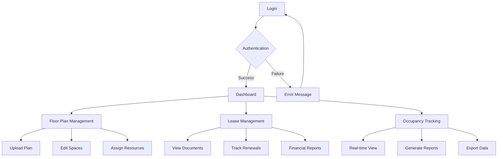

## 3.2 DATABASE DESIGN

### 3.2.1 Schema Design

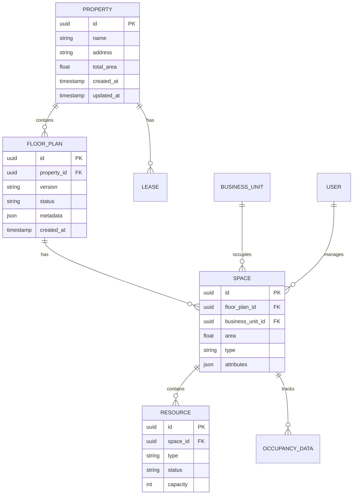

### 3.2.2 Data Management Strategy

| Aspect | Implementation |
|--------|---------------|
| Partitioning | - Time-based partitioning for occupancy data<br>- Range partitioning for lease documents<br>- List partitioning for multi-tenant data |
| Indexing | - B-tree indexes for primary keys<br>- GiST indexes for spatial data<br>- Partial indexes for active records<br>- Covering indexes for common queries |
| Archival | - Monthly archival of inactive data<br>- Compressed storage format<br>- Automated cleanup jobs<br>- Audit trail preservation |
| Backup | - Daily incremental backups<br>- Weekly full backups<br>- Point-in-time recovery<br>- Cross-region replication |

### 3.2.3 Performance Optimization

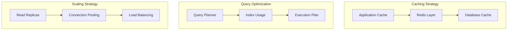

## 3.3 API DESIGN

### 3.3.1 API Architecture

| Component | Specification |
|-----------|--------------|
| Protocol | RESTful HTTP/2 |
| Authentication | OAuth 2.0 + JWT |
| Rate Limiting | - 1000 requests/hour per client<br>- Token bucket algorithm<br>- Custom limits for premium clients |
| Versioning | URI-based versioning (v1, v2) |
| Documentation | OpenAPI 3.0 Specification |
| Security | - TLS 1.3 required<br>- CORS policy enforcement<br>- Request signing |

### 3.3.2 API Endpoints

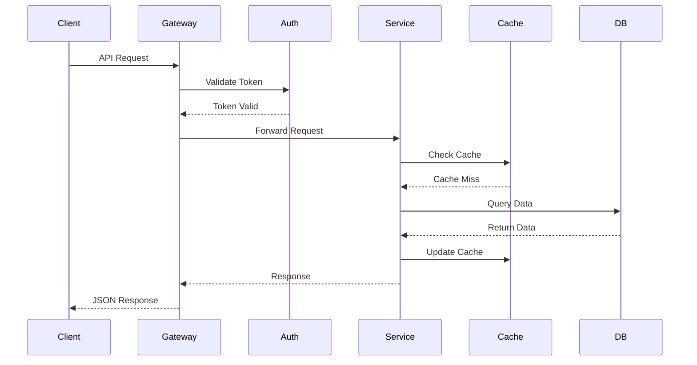

### 3.3.3 Integration Patterns

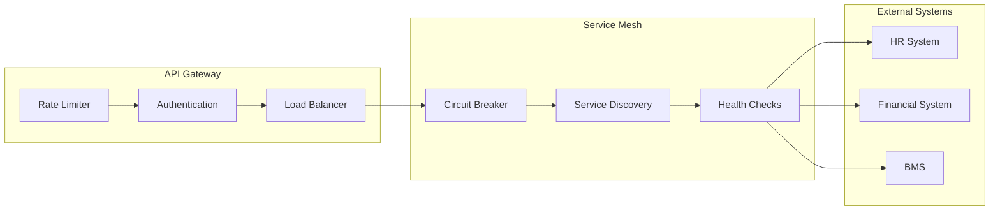

# 4. TECHNOLOGY STACK

## 4.1 PROGRAMMING LANGUAGES

| Platform | Language | Version | Justification |
|----------|----------|---------|---------------|
| Backend | Node.js | 18 LTS | - Strong ecosystem for real-time applications<br>- Excellent performance for API services<br>- Native async/await support<br>- Extensive package ecosystem |
| Frontend | TypeScript | 5.0+ | - Type safety for large-scale applications<br>- Enhanced IDE support<br>- Improved maintainability<br>- Better team collaboration |
| Database | SQL | PostgreSQL 14 | - Complex spatial data requirements<br>- ACID compliance<br>- Advanced indexing capabilities |
| DevOps | Python | 3.11+ | - Automation scripting<br>- Infrastructure management<br>- Data processing tasks |

## 4.2 FRAMEWORKS & LIBRARIES

### Backend Framework Stack

| Component | Technology | Version | Purpose |
|-----------|------------|---------|----------|
| API Framework | Express.js | 4.18+ | - Lightweight and flexible<br>- Extensive middleware ecosystem<br>- High performance routing |
| API Gateway | Kong | 3.0+ | - Advanced rate limiting<br>- Plugin architecture<br>- Enterprise-grade security |
| Real-time | Socket.io | 4.6+ | - Bi-directional communication<br>- Automatic fallback mechanisms<br>- Room-based broadcasting |
| Validation | Joi | 17+ | - Schema validation<br>- Type coercion<br>- Custom validation rules |

### Frontend Framework Stack

| Component | Technology | Version | Purpose |
|-----------|------------|---------|----------|
| UI Framework | React | 18+ | - Component-based architecture<br>- Virtual DOM performance<br>- Large ecosystem |
| UI Components | Material-UI | 5.0+ | - Enterprise-grade components<br>- Accessibility support<br>- Customizable theming |
| State Management | Redux Toolkit | 1.9+ | - Predictable state updates<br>- DevTools integration<br>- Middleware support |
| Data Visualization | D3.js | 7.0+ | - Custom floor plan rendering<br>- Interactive visualizations<br>- SVG manipulation |

## 4.3 DATABASES & STORAGE

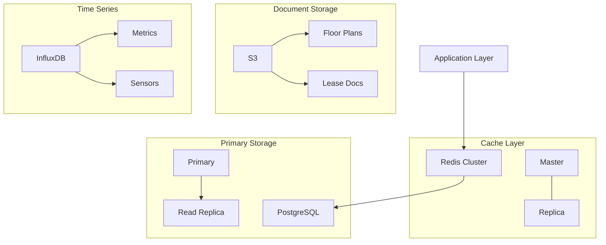

| Type | Technology | Version | Purpose |
|------|------------|---------|----------|
| Primary Database | PostgreSQL | 14+ | - Structured data storage<br>- Spatial data support<br>- JSONB for flexible schemas |
| Cache Layer | Redis | 7.0+ | - Session management<br>- API response caching<br>- Real-time data |
| Document Store | S3 | - | - Floor plan storage<br>- Lease document archive<br>- Report generation |
| Time Series | InfluxDB | 2.6+ | - Sensor data storage<br>- Metrics collection<br>- Performance monitoring |

## 4.4 THIRD-PARTY SERVICES

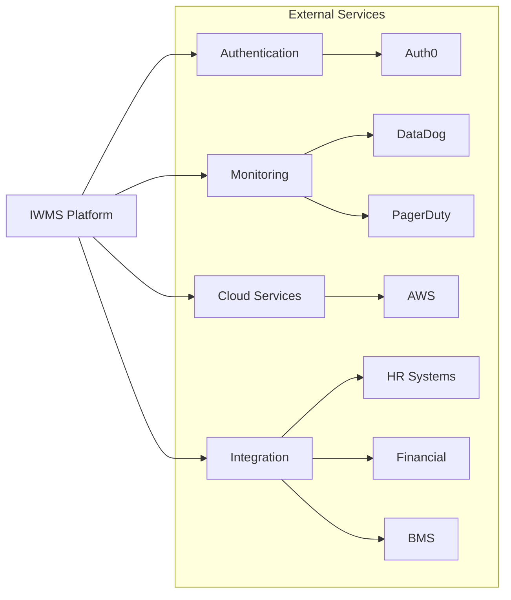

| Category | Service | Purpose | Integration Method |
|----------|---------|---------|-------------------|
| Authentication | Auth0 | - SSO provider<br>- MFA support<br>- User management | SAML/OAuth 2.0 |
| Monitoring | DataDog | - Application monitoring<br>- Log aggregation<br>- Performance metrics | Agent/API |
| Cloud Platform | AWS | - Infrastructure hosting<br>- Managed services<br>- Global CDN | SDK/API |
| Email Service | SendGrid | - Transactional emails<br>- Notification delivery<br>- Email templates | REST API |

## 4.5 DEVELOPMENT & DEPLOYMENT

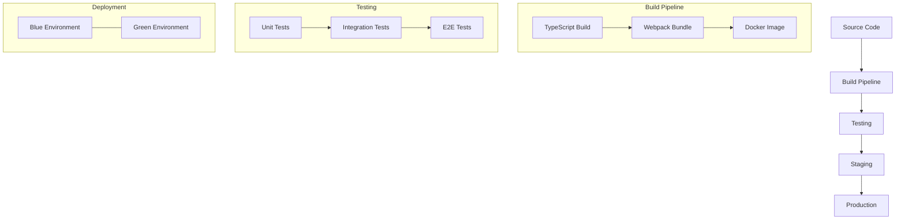

| Category | Tool | Version | Purpose |
|----------|------|---------|----------|
| Version Control | Git | 2.40+ | - Source code management<br>- Feature branching<br>- Code review |
| CI/CD | GitHub Actions | - | - Automated builds<br>- Test execution<br>- Deployment automation |
| Containerization | Docker | 24+ | - Application packaging<br>- Environment consistency<br>- Scalable deployment |
| Infrastructure | Terraform | 1.5+ | - Infrastructure as code<br>- Environment provisioning<br>- Resource management |

# 5. SYSTEM DESIGN

## 5.1 USER INTERFACE DESIGN

### 5.1.1 Layout Structure

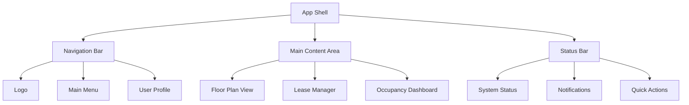

### 5.1.2 Component Specifications

| Component | Layout | Behavior | Accessibility |
|-----------|---------|-----------|---------------|
| Navigation Bar | Fixed top, 64px height | Sticky scroll, collapsible menu | ARIA landmarks, keyboard nav |
| Floor Plan View | Responsive grid, 80% viewport | Pan/zoom gestures, overlay controls | Alt text for visual elements |
| Lease Manager | Split view, 60/40 layout | Document preview, form inputs | ARIA live regions |
| Occupancy Dashboard | Card-based grid, auto-flow | Real-time updates, filters | Screen reader optimized |
| Status Bar | Fixed bottom, 32px height | Notification badges, tooltips | Role="status" |

### 5.1.3 Responsive Breakpoints

| Breakpoint | Width | Layout Adjustments |
|------------|-------|-------------------|
| Mobile | < 768px | Single column, stacked navigation |
| Tablet | 768px - 1024px | Two column, condensed navigation |
| Desktop | 1024px - 1440px | Multi-column, expanded navigation |
| Large Display | > 1440px | Full layout with sidebars |

## 5.2 DATABASE DESIGN

### 5.2.1 Schema Design


### 5.2.2 Data Management Strategy

| Aspect | Implementation |
|--------|---------------|
| Partitioning | - Time-based partitioning for occupancy data<br>- Range partitioning for lease documents<br>- List partitioning for multi-tenant data |
| Indexing | - B-tree indexes for primary keys<br>- GiST indexes for spatial data<br>- Partial indexes for active records |
| Archival | - Monthly archival of inactive data<br>- Compressed storage format<br>- Automated cleanup jobs |
| Backup | - Daily incremental backups<br>- Weekly full backups<br>- Point-in-time recovery |

## 5.3 API DESIGN

### 5.3.1 API Architecture


### 5.3.2 API Endpoints

| Category | Endpoint | Method | Description |
|----------|----------|--------|-------------|
| Floor Plans | /api/v1/floor-plans | GET, POST | Floor plan management |
| Spaces | /api/v1/spaces | GET, POST, PUT | Space allocation |
| Resources | /api/v1/resources | GET, POST, PUT | Resource management |
| Leases | /api/v1/leases | GET, POST, PUT | Lease document handling |
| Occupancy | /api/v1/occupancy | GET | Real-time occupancy data |

### 5.3.3 Authentication & Security

| Security Layer | Implementation |
|----------------|----------------|
| Authentication | OAuth 2.0 + JWT |
| Rate Limiting | Token bucket algorithm |
| API Versioning | URI-based (v1, v2) |
| Request Validation | JSON Schema validation |
| Response Format | HAL+JSON |
| Error Handling | RFC 7807 Problem Details |

### 5.3.4 WebSocket Events

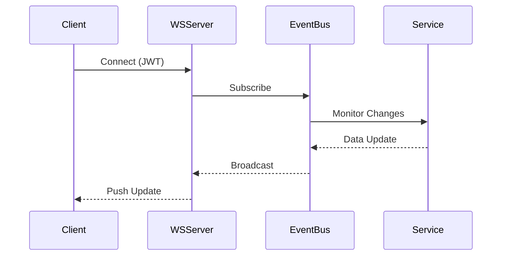

| Event Type | Channel | Payload |
|------------|---------|---------|
| occupancy.update | /occupancy/{space_id} | Current count, timestamp |
| resource.status | /resources/{resource_id} | Status change, metadata |
| lease.notification | /leases/{lease_id} | Alert type, details |
| system.status | /system | Health status, metrics |

# 6. USER INTERFACE DESIGN

## 6.1 Design System

### Component Key
```
Icons:
[?] - Help/Information tooltip
[$] - Financial/Payment related
[i] - Information
[+] - Add/Create new item
[x] - Close/Delete
[<][>] - Navigation controls
[^] - Upload function
[#] - Menu/Dashboard
[@] - User profile
[!] - Alerts/Warnings
[=] - Settings menu
[*] - Favorite/Important

Interactive Elements:
[ ] - Checkbox
( ) - Radio button
[Button] - Clickable button
[...] - Text input field
[====] - Progress indicator
[v] - Dropdown menu
```

## 6.2 Main Navigation

```
+----------------------------------------------------------+
|  [#] Lightweight IWMS             [@] Admin    [?] [=]    |
+----------------------------------------------------------+
|                                                           |
|  +----------------+ +---------------+ +----------------+   |
|  | Floor Plans    | | Lease Mgmt    | | Occupancy      |  |
|  | [*] Building A | | [$] Active: 12| | [!] Alert: 85% |  |
|  | [i] 4 Floors   | | [!] Due: 2    | | [====] Usage   |  |
|  +----------------+ +---------------+ +----------------+   |
|                                                           |
+----------------------------------------------------------+
```

## 6.3 Floor Plan Manager

```
+----------------------------------------------------------+
| Floor Plan Manager                     [^] Upload  [+] New |
+----------------------------------------------------------+
| Building: [v] Building A    Floor: [v] Floor 3            |
+----------------------------------------------------------+
|                                                           |
|  +------------------------+  +-----------------------+     |
|  |  Floor Plan View       |  | Space Details        |     |
|  |                        |  | ID: SP-301           |     |
|  |  [Interactive Area]    |  | Type: [v] Office     |     |
|  |                        |  | Area: [...] sq ft    |     |
|  |  [<] [>] [+] [-]      |  | Status: [v] Active   |     |
|  |                        |  |                      |     |
|  |  Scale: 100%          |  | Assigned to:         |     |
|  |                        |  | [ ] Business Unit A  |     |
|  +------------------------+  | [ ] Business Unit B  |     |
|                             |                      |     |
|                             | [Save] [Cancel]      |     |
|                             +-----------------------+     |
+----------------------------------------------------------+
```

## 6.4 Lease Management Dashboard

```
+----------------------------------------------------------+
| Lease Management                    [$] Total: $1.2M/year |
+----------------------------------------------------------+
| Filter: [...................] [Button: Apply]              |
+----------------------------------------------------------+
|                                                           |
| +-------------------+  +--------------------------------+ |
| | Lease Overview    |  | Upcoming Renewals              | |
| | Active    : 12    |  | [!] 30 Days                   | |
| | Pending   : 03    |  | +-- Building A, Floor 4       | |
| | Expired   : 01    |  | +-- Building B, Suite 300     | |
| +-------------------+  |                                | |
|                       | [!] 60 Days                    | |
| +-------------------+ | +-- Building C, Floor 2        | |
| | Quick Actions     | |                                | |
| | [+] New Lease     | | [!] 90 Days                   | |
| | [^] Upload Doc    | | +-- Building A, Floor 1       | |
| | [$] Payments      | |                                | |
| +-------------------+ +--------------------------------+ |
+----------------------------------------------------------+
```

## 6.5 Occupancy Analytics

```
+----------------------------------------------------------+
| Occupancy Analytics                    [Export] [Share]    |
+----------------------------------------------------------+
| Time Range: [v] Last 30 Days    Update: [v] Real-time     |
+----------------------------------------------------------+
|                                                           |
| +-------------------+  +--------------------------------+ |
| | Current Status    |  | Occupancy Trends               | |
| | [====] 75%        |  |        ^                      | |
| | 150/200 seats     |  |        |                      | |
| |                   |  |     [Graph Area]              | |
| | Peak Today: 85%   |  |        |                      | |
| | Avg Utilization   |  |        +------------------>   | |
| | [======] 65%      |  |         M T W T F S S        | |
| +-------------------+  +--------------------------------+ |
|                                                           |
| +--------------------------------------------------+     |
| | Alerts & Notifications                            |     |
| | [!] Floor 3 above 90% capacity - 2:30 PM         |     |
| | [!] Meeting Room A201 unused for 5 days          |     |
| | [i] Weekly utilization report ready              |     |
| +--------------------------------------------------+     |
+----------------------------------------------------------+
```

## 6.6 Mobile Responsive Layout

```
+------------------------+
| [#] IWMS    [@] [=]   |
+------------------------+
| Quick Actions:         |
| +------------------+  |
| | [#] Dashboard    |  |
| | [$] Leases       |  |
| | [i] Floor Plans  |  |
| | [!] Alerts (3)   |  |
| +------------------+  |
|                      |
| Recent Activity:      |
| +------------------+ |
| | Floor 3 Updated  | |
| | Lease Renewed    | |
| | Alert Cleared    | |
| +------------------+ |
|                      |
| [+ Quick Add]        |
+------------------------+
```

## 6.7 Settings Panel

```
+----------------------------------------------------------+
| System Settings                         [@] Admin Access   |
+----------------------------------------------------------+
| +------------------------+  +---------------------------+  |
| | Configuration          |  | Active Changes            |  |
| | +-- User Management    |  |                          |  |
| | +-- Notifications     |  | No pending changes        |  |
| | +-- Integrations      |  |                          |  |
| | +-- Data Management   |  | [Save All] [Revert]      |  |
| +------------------------+  +---------------------------+  |
|                                                          |
| Selected: User Management                                |
| +--------------------------------------------------+    |
| | Role Permissions                                  |    |
| | ( ) View Only                                    |    |
| | ( ) Editor                                       |    |
| | ( ) Administrator                                |    |
| |                                                  |    |
| | Feature Access:                                  |    |
| | [ ] Floor Plan Management                        |    |
| | [ ] Lease Administration                         |    |
| | [ ] Occupancy Analytics                          |    |
| | [ ] System Configuration                         |    |
| +--------------------------------------------------+    |
+----------------------------------------------------------+
```

# 7. SECURITY CONSIDERATIONS

## 7.1 AUTHENTICATION AND AUTHORIZATION

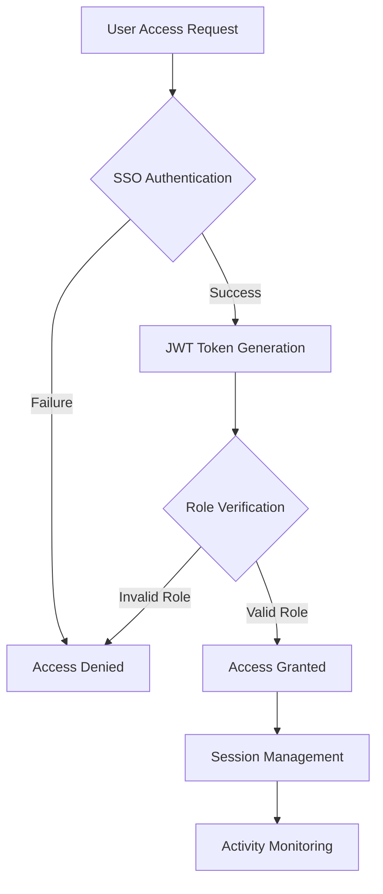

| Authentication Method | Implementation Details | Purpose |
|----------------------|------------------------|----------|
| SSO Integration | - Auth0 implementation<br>- SAML 2.0 protocol<br>- OpenID Connect support | Primary authentication method |
| MFA | - Time-based OTP<br>- SMS verification<br>- Hardware key support | Additional security layer |
| API Authentication | - OAuth 2.0<br>- JWT tokens<br>- API key management | Service-to-service auth |

### Role-Based Access Control (RBAC)

| Role | Permissions | Access Level |
|------|------------|--------------|
| System Administrator | - Full system access<br>- User management<br>- Configuration control | Full |
| Facility Manager | - Floor plan management<br>- Resource allocation<br>- Occupancy monitoring | High |
| Space Planner | - Floor plan viewing<br>- Space allocation<br>- Reporting access | Medium |
| BU Administrator | - Business unit space view<br>- Resource assignment<br>- Basic reporting | Limited |

## 7.2 DATA SECURITY

```mermaid
graph TD
    subgraph "Data Security Layers"
        A[Application Layer] --> B[Transport Layer]
        B --> C[Storage Layer]
        
        subgraph "Encryption"
            D[TLS 1.3]
            E[AES-256]
            F[Key Management]
        end
        
        subgraph "Access Controls"
            G[Row-Level Security]
            H[Column Encryption]
            I[Data Masking]
        end
    end
```

| Security Layer | Implementation | Standards |
|----------------|----------------|-----------|
| Data at Rest | - AES-256 encryption<br>- Encrypted backups<br>- Secure key storage | FIPS 140-2 |
| Data in Transit | - TLS 1.3<br>- Perfect Forward Secrecy<br>- Strong cipher suites | PCI DSS |
| Database Security | - Row-level security<br>- Encrypted columns<br>- Audit logging | ISO 27001 |

### Data Classification

| Classification | Examples | Security Controls |
|----------------|----------|-------------------|
| Highly Sensitive | - Lease financial data<br>- Authentication credentials | - Field-level encryption<br>- Access logging<br>- MFA required |
| Sensitive | - Floor plans<br>- Occupancy data | - Role-based access<br>- Encryption at rest<br>- Audit trails |
| Internal | - Resource metadata<br>- Usage statistics | - Standard access controls<br>- Transport encryption |
| Public | - Building addresses<br>- Public space info | - Basic validation<br>- Integrity checks |

## 7.3 SECURITY PROTOCOLS

```mermaid
sequenceDiagram
    participant User
    participant WAF
    participant Gateway
    participant Service
    participant Database

    User->>WAF: HTTPS Request
    WAF->>WAF: Security Checks
    WAF->>Gateway: Validated Request
    Gateway->>Gateway: Rate Limiting
    Gateway->>Service: Authenticated Request
    Service->>Database: Encrypted Query
    Database-->>Service: Encrypted Response
    Service-->>User: Secured Response
```

### Security Standards Compliance

| Standard | Implementation Requirements | Validation Method |
|----------|---------------------------|-------------------|
| OWASP Top 10 | - Input validation<br>- XSS prevention<br>- CSRF protection | Security scanning |
| ISO 27001 | - Security controls<br>- Risk management<br>- Incident response | Annual audit |
| GDPR/CCPA | - Data privacy controls<br>- Consent management<br>- Data portability | Compliance review |

### Security Monitoring and Response

| Component | Implementation | Alert Triggers |
|-----------|----------------|----------------|
| WAF | - CloudFront WAF<br>- Custom rule sets<br>- IP reputation filtering | - Injection attempts<br>- Unusual traffic patterns |
| Intrusion Detection | - Network monitoring<br>- Behavior analysis<br>- Log analysis | - Authentication failures<br>- Policy violations |
| Security Logging | - Centralized logging<br>- Log retention policy<br>- Access tracking | - Unauthorized access<br>- System changes |

### Security Update Protocol

| Type | Frequency | Process |
|------|-----------|---------|
| Security Patches | Monthly | - Testing in staging<br>- Automated deployment<br>- Rollback capability |
| Vulnerability Scans | Weekly | - Automated scanning<br>- Report generation<br>- Risk assessment |
| Penetration Testing | Bi-annual | - External testing<br>- Vulnerability validation<br>- Remediation planning |

# 8. INFRASTRUCTURE

## 8.1 DEPLOYMENT ENVIRONMENT

```mermaid
flowchart TD
    subgraph Production
        A[Load Balancer] --> B1[Web Tier]
        A --> B2[Web Tier]
        B1 --> C1[App Tier]
        B2 --> C2[App Tier]
        C1 --> D[Data Tier]
        C2 --> D
    end

    subgraph Staging
        E[Load Balancer] --> F[Web/App Tier]
        F --> G[Data Tier]
    end

    subgraph Development
        H[Combined Tier]
    end
```

| Environment | Configuration | Purpose |
|-------------|--------------|----------|
| Production | Multi-region, HA setup | Live system serving end users |
| Staging | Single region, scaled-down | Pre-production testing and validation |
| Development | Minimal infrastructure | Development and initial testing |
| DR Site | Passive standby | Business continuity assurance |

## 8.2 CLOUD SERVICES

| Service Category | AWS Service | Purpose | Configuration |
|-----------------|-------------|----------|---------------|
| Compute | ECS Fargate | Container hosting | Auto-scaling, spot instances |
| Database | RDS PostgreSQL | Primary database | Multi-AZ, read replicas |
| Cache | ElastiCache | Redis caching layer | Cluster mode enabled |
| Storage | S3 | Document storage | Versioning enabled |
| CDN | CloudFront | Static content delivery | Edge locations worldwide |
| Monitoring | CloudWatch | System monitoring | Custom metrics, dashboards |
| Security | WAF & Shield | DDoS protection | Enterprise protection |

## 8.3 CONTAINERIZATION

```mermaid
graph TD
    subgraph Container Architecture
        A[Base Image] --> B[Node.js Runtime]
        B --> C[Application Code]
        C --> D[Final Image]
    end
    
    subgraph Image Layers
        E[Security Patches]
        F[Dependencies]
        G[Application]
        H[Configuration]
    end
    
    D --> E
    E --> F
    F --> G
    G --> H
```

| Component | Implementation | Configuration |
|-----------|---------------|---------------|
| Base Image | node:18-alpine | Minimal secure base |
| Runtime | Node.js 18 LTS | Production optimized |
| Dependencies | npm packages | Multi-stage builds |
| Configuration | Environment variables | External config management |
| Security | Vulnerability scanning | Automated checks |

## 8.4 ORCHESTRATION

```mermaid
graph TD
    subgraph "ECS Cluster"
        A[Service Discovery]
        B[Task Definitions]
        C[Auto Scaling]
        
        subgraph "Services"
            D[Web Service]
            E[API Service]
            F[Worker Service]
        end
        
        A --> D
        A --> E
        A --> F
        
        B --> D
        B --> E
        B --> F
        
        C --> D
        C --> E
        C --> F
    end
```

| Component | Configuration | Scaling Policy |
|-----------|---------------|---------------|
| Web Service | 2-6 tasks, 2 vCPU, 4GB RAM | CPU utilization > 70% |
| API Service | 2-8 tasks, 2 vCPU, 4GB RAM | Request count based |
| Worker Service | 1-4 tasks, 1 vCPU, 2GB RAM | Queue length based |
| Task Placement | Spread across AZs | Availability optimized |

## 8.5 CI/CD PIPELINE

```mermaid
flowchart LR
    A[Source] --> B[Build]
    B --> C[Test]
    C --> D[Security Scan]
    D --> E[Artifact]
    E --> F[Deploy Staging]
    F --> G[Integration Tests]
    G --> H[Deploy Prod]
    
    subgraph "Quality Gates"
        C
        D
        G
    end
```

| Stage | Tools | Actions | Success Criteria |
|-------|-------|---------|-----------------|
| Source | GitHub | Code commit, PR review | PR approval, branch policies |
| Build | GitHub Actions | Compile, lint, package | Build success, no warnings |
| Test | Jest, Cypress | Unit, integration tests | 90% coverage, all tests pass |
| Security | Snyk, SonarQube | Vulnerability scan, code quality | No high severity issues |
| Artifact | ECR | Container image creation | Image scan passed |
| Deploy | Terraform, AWS CDK | Infrastructure deployment | Health checks pass |
| Verify | Postman, k6 | Integration testing | Performance metrics met |

# APPENDICES

## A.1 ADDITIONAL TECHNICAL INFORMATION

### A.1.1 Browser Support Matrix

| Browser | Minimum Version | Notes |
|---------|----------------|-------|
| Chrome | 90+ | Full feature support |
| Firefox | 88+ | Full feature support |
| Safari | 14+ | Limited 3D rendering |
| Edge | 91+ | Full feature support |
| Mobile Chrome | 90+ | Touch optimization required |
| Mobile Safari | 14+ | iOS gesture handling |

### A.1.2 File Format Support

| Category | Format | Max Size | Notes |
|----------|--------|----------|-------|
| Floor Plans | DWG, DXF | 50MB | AutoCAD 2018+ |
| Floor Plans | PDF | 25MB | PDF/A-1b compliant |
| Images | PNG, JPG | 10MB | 300dpi minimum |
| Documents | PDF, DOCX | 15MB | Searchable text required |
| Data Export | CSV, XLSX | 50MB | UTF-8 encoding |

### A.1.3 Integration Points

```mermaid
graph TD
    A[IWMS Core] --> B[External Systems]
    B --> C[HR Systems]
    B --> D[Financial]
    B --> E[BMS]
    B --> F[SSO]
    
    C --> C1[Employee Data]
    C --> C2[Department Info]
    
    D --> D1[Lease Payments]
    D --> D2[Cost Centers]
    
    E --> E1[Occupancy Data]
    E --> E2[Sensor Feeds]
    
    F --> F1[Authentication]
    F --> F2[User Roles]
```

## A.2 GLOSSARY

| Term | Definition |
|------|------------|
| Asset Lifecycle | The stages through which a workplace asset passes from acquisition to disposal |
| Building Management System | Computerized system controlling and monitoring building mechanical and electrical equipment |
| Common Area | Shared spaces in a building accessible to all tenants |
| Floor Plan Overlay | Visual layer displaying specific data on top of a floor plan |
| Hot Desking | Practice of allocating desks to workers when needed rather than giving each worker their own desk |
| Lease Escalation | Scheduled increase in lease payments over the term of the lease |
| Net Rentable Area | Total floor area of a building that can be rented to tenants |
| Occupancy Rate | Percentage of total space that is currently occupied |
| Space Planning | Process of organizing furniture and functions to fit in an available space |
| Tenant Improvement | Customization of a rental space to meet a tenant's needs |
| Utilization Rate | Measure of how effectively space is being used |
| Workspace Density | Number of workstations or employees per unit of floor space |

## A.3 ACRONYMS

| Acronym | Full Form |
|---------|-----------|
| ADA | Americans with Disabilities Act |
| API | Application Programming Interface |
| BMS | Building Management System |
| BOMA | Building Owners and Managers Association |
| CAD | Computer-Aided Design |
| CAFM | Computer-Aided Facility Management |
| CAM | Common Area Maintenance |
| CCPA | California Consumer Privacy Act |
| CDN | Content Delivery Network |
| CRE | Corporate Real Estate |
| DMS | Document Management System |
| GDPR | General Data Protection Regulation |
| HA | High Availability |
| IAM | Identity and Access Management |
| IFMA | International Facility Management Association |
| IoT | Internet of Things |
| IWMS | Integrated Workplace Management System |
| JWT | JSON Web Token |
| KPI | Key Performance Indicator |
| MFA | Multi-Factor Authentication |
| NRA | Net Rentable Area |
| RBAC | Role-Based Access Control |
| REST | Representational State Transfer |
| ROI | Return on Investment |
| SAML | Security Assertion Markup Language |
| SLA | Service Level Agreement |
| SSO | Single Sign-On |
| TLS | Transport Layer Security |
| UI/UX | User Interface/User Experience |
| WCAG | Web Content Accessibility Guidelines |